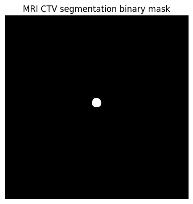
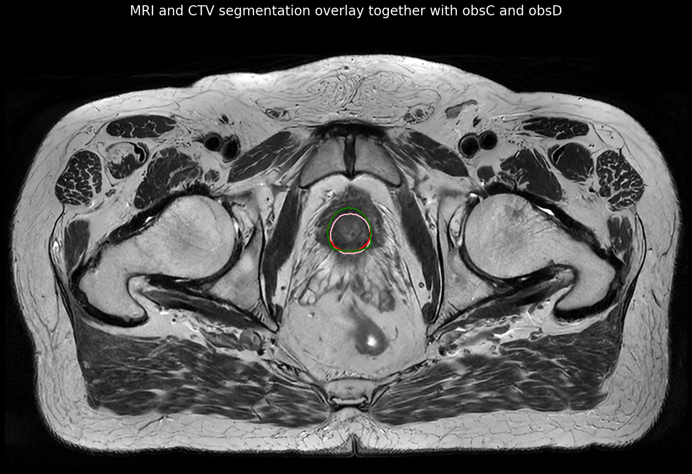
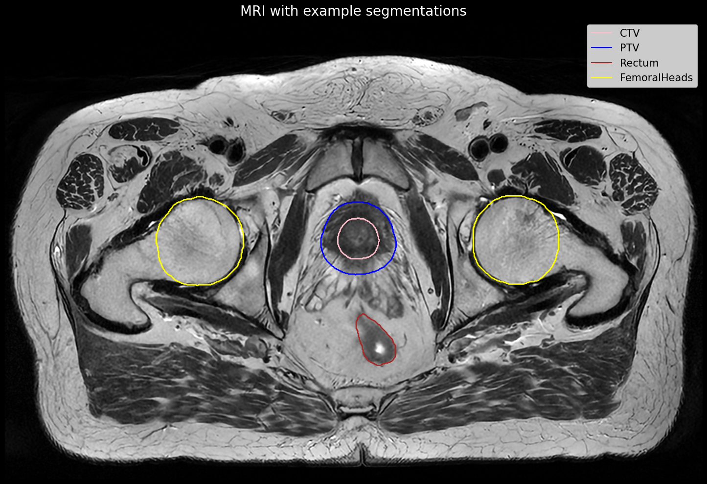
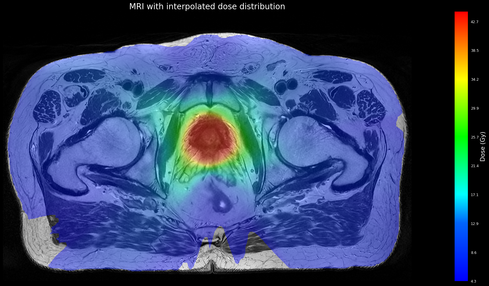
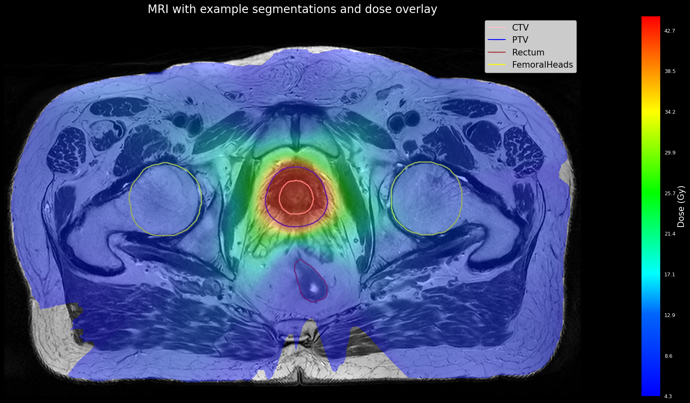
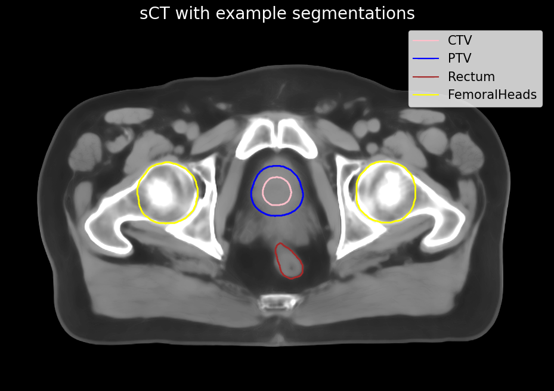
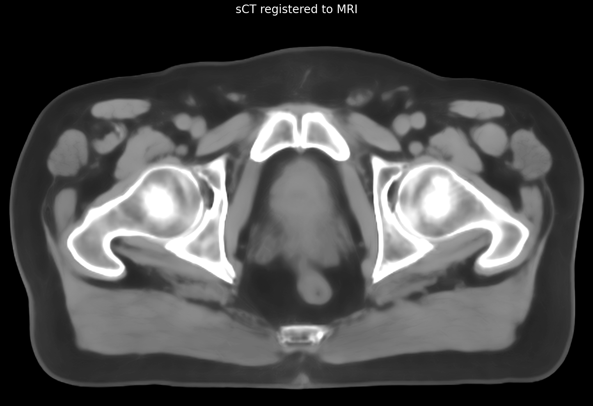

<div style="background-color: white; padding: 10px; border: 1px solid black; text-align: center;">
    
</div>

<small>Description:</small>
<small>LUND-PROBE is a dataset, comprising clinical MRI- and synthetic CT (sCT) images in 3D NIfTI format, target and OARs segmentations, and radiotherapy dose distributions for 432 prostate cancer patients treated with MRI-based radiotherapy treatment planning. An extended part with 35 patients is also included, with the addition of deep learning (DL)-generated segmentations, DL segmentation uncertainty maps, and DL segmentations manually adjusted by four radiation oncologists.</small>

<small>This notebook provides sample code for loading and visualizing the LUND-PROBE data. Follow along and feel free to modify the examples to suit your specific use case! Instructions on how to access the data is found at the AIDA Data Hub:
https://datahub.aida.scilifelab.se/10.23698/aida/lund-probe and data details are found in the file ["Data_table.pdf"](https://github.com/jamtheim/LUND-PROBE/blob/main/Data_table.pdf). </small>
<small> Publication where the LUND-PROBE dataset data is described is found at [https://www.nature.com/articles/s41597-025-04954-5.](https://www.nature.com/articles/s41597-025-04954-5) </small>
<small> This dataset has also been used in the following publication: [https://aapm.onlinelibrary.wiley.com/doi/10.1002/acm2.70221.](https://aapm.onlinelibrary.wiley.com/doi/10.1002/acm2.70221) </small> 

<div style="background-color: black; padding: 10px; border: 1px solid black; text-align: center;">
    
</div>


```python
# *********************************************************************************
# Author: Christian Jamtheim Gustafsson, PhD, Medical Physcist Expert
# Author: Rogowski Viktor, Medical Physcist
# Skåne University Hospital, Lund, Sweden and Lund University, Lund, Sweden
# Description: Sample code for loading and visualizing the LUND-PROBE data.
# *********************************************************************************

# Import necessary libraries
import os
import numpy as np 
import matplotlib
import matplotlib.pyplot as plt
import SimpleITK as sitk
from matplotlib.colors import LinearSegmentedColormap, Normalize, hex2color
from matplotlib.cm import get_cmap
import math
# Import plot functions
from ioPlotFunctions import plotFunctions
# Initialize plot functions
plotFunctions = plotFunctions()
```


```python

############### START CONFIGURATION BLOCK ###############
# Define the base path
basePath = r'YourPathHere'
# Define selected patient 
patient = "YourPatientHere"
# Define the full subject directory
subjectDir = os.path.join(basePath, patient)
# Define names of the MRI and sCT sub directories used in the data 
MRIDir = 'MR_StorT2'
sCTDir = 'sCT'
nnUNetOutputDir = 'nnUNetOutput'
observerDataDir = 'observerData'
# Define the paths to the MRI, sCT volumes and dose volumes 
MRIVolumePath = os.path.join(subjectDir, MRIDir, 'image.nii.gz')
sCTVolumePath = os.path.join(subjectDir, sCTDir, 'image.nii.gz')
sCTReg2MRIVolumePath = os.path.join(subjectDir, sCTDir, 'image_reg2MRI.nii.gz')
sCTDosePath = os.path.join(subjectDir, sCTDir, 'dose_original.nii.gz')
sCTDoseInterpolatedPath = os.path.join(subjectDir, sCTDir, 'dose_interpolated.nii.gz')
MRIDoseInterpolatedPath = os.path.join(subjectDir, MRIDir, 'dose_interpolated.nii.gz')
# Define path to fiducial point text file and segmentation mask
fiducialTxtPath = os.path.join(subjectDir, MRIDir, 'MRI_T2_DICOM_coords_fiducials.txt')
fiducialMaskPath = os.path.join(subjectDir, MRIDir, 'mask_MRI_T2_coords_fiducials.nii.gz')
# Define path for CTV and rectum uncertainty map
uncertaintyMapCTVPath = os.path.join(subjectDir, MRIDir, nnUNetOutputDir, 'mask_CTVT_427_nnUNet_uncertaintyMap.nii.gz')
uncertaintyMapRectumPath = os.path.join(subjectDir, MRIDir, nnUNetOutputDir, 'mask_Rectum_nnUNet_uncertaintyMap.nii.gz')
# Define paths for DL segmentations
DLCTVPath = os.path.join(subjectDir, MRIDir, nnUNetOutputDir, 'mask_CTVT_427_nnUNet.nii.gz') 
DLRectumPath = os.path.join(subjectDir, MRIDir, nnUNetOutputDir, 'mask_Rectum_nnUNet.nii.gz')
# Define paths for some sample MRI segmentations
MRICTVPath = os.path.join(subjectDir, MRIDir, 'mask_CTVT_427.nii.gz')
MRIPTVPath = os.path.join(subjectDir, MRIDir, 'mask_PTVT_427.nii.gz')
MRIRectumPath = os.path.join(subjectDir, MRIDir, 'mask_Rectum.nii.gz')
MRIFemoralHeadLPath = os.path.join(subjectDir, MRIDir, 'mask_FemoralHead_L.nii.gz')
MRIFemoralHeadRPath = os.path.join(subjectDir, MRIDir, 'mask_FemoralHead_R.nii.gz')
MRIBladderPath = os.path.join(subjectDir, MRIDir, 'mask_Bladder.nii.gz')
# Define paths for some sample sCT segmentations
sCTCTVPath = os.path.join(subjectDir, sCTDir, 'mask_CTVT_427.nii.gz')
sCTPTVPath = os.path.join(subjectDir, sCTDir, 'mask_PTVT_427.nii.gz')
sCTRectumPath = os.path.join(subjectDir, sCTDir, 'mask_Rectum.nii.gz')
sCTFemoralHeadLPath = os.path.join(subjectDir, sCTDir, 'mask_FemoralHead_L.nii.gz')
sCTFemoralHeadRPath = os.path.join(subjectDir, sCTDir, 'mask_FemoralHead_R.nii.gz')
# Define paths for two different observer segmentations (total four available, obsB-E)
MRICTVObsCPath = os.path.join(subjectDir, MRIDir, observerDataDir, 'mask_CTVT_427_step1_obsC.nii.gz') 
MRICTVObsDPath = os.path.join(subjectDir, MRIDir, observerDataDir, 'mask_CTVT_427_step1_obsD.nii.gz')
############### END CONFIGURATION BLOCK ###############
```


```python
# Load the volumes using SimpleITK
# Image volumes
MRIImage = sitk.ReadImage(MRIVolumePath)
sCTImage = sitk.ReadImage(sCTVolumePath)
sCTReg2MRIImage = sitk.ReadImage(sCTReg2MRIVolumePath)
sCTDoseImage = sitk.ReadImage(sCTDosePath)
sCTDoseInterpolatedImage = sitk.ReadImage(sCTDoseInterpolatedPath)
MRIDoseInterpolatedImage = sitk.ReadImage(MRIDoseInterpolatedPath)
# Fiducial points
fiducialImage  = sitk.ReadImage(fiducialMaskPath)
# Uncertainty maps
uncertaintyMapCTVImage = sitk.ReadImage(uncertaintyMapCTVPath)
uncertainyyMapRectumImage = sitk.ReadImage(uncertaintyMapRectumPath)
# DL segmentations
DLCTVImage = sitk.ReadImage(DLCTVPath)
DLRectumImage = sitk.ReadImage(DLRectumPath)
# Segmentations volumes MRI
MRICTVImage = sitk.ReadImage(MRICTVPath)
MRIRectumImage = sitk.ReadImage(MRIRectumPath)
MRIFemoralHeadLImage = sitk.ReadImage(MRIFemoralHeadLPath)
MRIFemoralHeadRImage = sitk.ReadImage(MRIFemoralHeadRPath)
MRIPTVImage = sitk.ReadImage(MRIPTVPath)
MRIBladderImage = sitk.ReadImage(MRIBladderPath)
# Segmentations volumes sCT 
sCTCTVImage = sitk.ReadImage(sCTCTVPath)
sCTPTVImage = sitk.ReadImage(sCTPTVPath)
sCTRectumImage = sitk.ReadImage(sCTRectumPath)
sCTFemoralHeadLImage = sitk.ReadImage(sCTFemoralHeadLPath)
sCTFemoralHeadRImage = sitk.ReadImage(sCTFemoralHeadRPath)
# Observer segmentations
MRICTVObsCImage = sitk.ReadImage(MRICTVObsCPath)
MRICTVObsDImage = sitk.ReadImage(MRICTVObsDPath)
```


```python
# Read the fiducial points from the text file. These are DICOM coorinates. 
with open(fiducialTxtPath, 'r', encoding='utf-8') as file:
            lines = file.readlines()

# Assert that the file contains exactly 3 lines
assert len(lines) == 3, f"Expected 3 lines, but found {len(lines)} lines."

# Parse each line and store in a list
coordinates = []
for i, line in enumerate(lines, start=1):
    values = line.strip().split(',')
    # Assert that each line contains exactly 3 values
    assert len(values) == 3, f"Line {i} does not contain exactly 3 values: {line.strip()}"
    coordinates.append(list(map(float, values)))  # Convert to float and append as a list

# Assign each point to its respective variable
point1, point2, point3 = coordinates  # Unpack the list into individual variables
# Output the results
print("Point 1:", point1)
print("Point 2:", point2)
print("Point 3:", point3)
```

    Point 1: [-13.36, -26.98, -6.32]
    Point 2: [3.98, -29.32, -11.32]
    Point 3: [3.51, -19.47, 6.18]


```python
# Get the numpy arrays of the images from the SimpleITK objects
# Image volumes
MRIArray = sitk.GetArrayFromImage(MRIImage)
sCTArray = sitk.GetArrayFromImage(sCTImage)
sCTReg2MRIArray = sitk.GetArrayFromImage(sCTReg2MRIImage)
sCTDoseArray = sitk.GetArrayFromImage(sCTDoseImage)
sCTDoseInterpolatedArray = sitk.GetArrayFromImage(sCTDoseInterpolatedImage)
MRIDoseInterpolatedArray = sitk.GetArrayFromImage(MRIDoseInterpolatedImage)
# Uncertainty maps
uncertaintyMapCTVArray = sitk.GetArrayFromImage(uncertaintyMapCTVImage)
uncertaintyMapRectumArray = sitk.GetArrayFromImage(uncertainyyMapRectumImage)
# DL segmentations
DLCTVArray = sitk.GetArrayFromImage(DLCTVImage)
DLRectumArray = sitk.GetArrayFromImage(DLRectumImage)
# Fiducial points
fiducialArray = sitk.GetArrayFromImage(fiducialImage)
# Segmentation volumes MRI
MRICTVArray = sitk.GetArrayFromImage(MRICTVImage)
MRIRectumArray = sitk.GetArrayFromImage(MRIRectumImage)
MRIFemoralHeadLArray = sitk.GetArrayFromImage(MRIFemoralHeadLImage)
MRIFemoralHeadRArray = sitk.GetArrayFromImage(MRIFemoralHeadRImage)
MRIPTVArray = sitk.GetArrayFromImage(MRIPTVImage)
MRIBladderArray = sitk.GetArrayFromImage(MRIBladderImage)
# Segmentations volumes sCT
sCTCTVArray = sitk.GetArrayFromImage(sCTCTVImage)
sCTPTVArray = sitk.GetArrayFromImage(sCTPTVImage)
sCTRectumArray = sitk.GetArrayFromImage(sCTRectumImage)
sCTFemoralHeadLArray = sitk.GetArrayFromImage(sCTFemoralHeadLImage)
sCTFemoralHeadRArray = sitk.GetArrayFromImage(sCTFemoralHeadRImage)
# Observer segmentations
MRICTVObsCArray = sitk.GetArrayFromImage(MRICTVObsCImage)
MRICTVObsDArray = sitk.GetArrayFromImage(MRICTVObsDImage)
```


```python
# Get the image resolutions (spacing in mm) and print it for each image
MRIImageSpacing = MRIImage.GetSpacing()
print(f'MRI image spacing: {MRIImageSpacing}')
uncertaintyMapCTVSapcing = uncertaintyMapCTVImage.GetSpacing()
print(f'CTV uncertainty map spacing: {uncertaintyMapCTVSapcing}')
uncertainyyMapRectumSpacing = uncertainyyMapRectumImage.GetSpacing()
print(f'Rectum uncertainty map spacing: {uncertainyyMapRectumSpacing}')
sCTImageSpacing = sCTImage.GetSpacing()
print(f'sCT image spacing: {sCTImageSpacing}')
sCTReg2MRIImageSpacing = sCTReg2MRIImage.GetSpacing()
print(f'sCT registered to MRI image spacing: {sCTReg2MRIImageSpacing}')
sCTDoseImageSpacing = sCTDoseImage.GetSpacing()
print(f'sCT dose image spacing: {sCTDoseImageSpacing}')
sCTDosenterpolatedImageSpacing = sCTDoseInterpolatedImage.GetSpacing()
print(f'sCT dose interpolated image spacing: {sCTDosenterpolatedImageSpacing}')
MRIDoseInterpolatedImageSpacing = MRIDoseInterpolatedImage.GetSpacing()
print(f'MRI dose interpolated image spacing: {MRIDoseInterpolatedImageSpacing}')
fiducialImageSpacing = fiducialImage.GetSpacing()
print(f'fiducial image spacing: {fiducialImageSpacing}')
MRICTVImageSpacing = MRICTVImage.GetSpacing()
print(f'MRI CTV image spacing: {MRICTVImageSpacing}')
MRIRectumImageSpacing = MRIRectumImage.GetSpacing()
print(f'MRI rectum image spacing: {MRIRectumImageSpacing}')
MRIFemoralHeadLImageSpacing = MRIFemoralHeadLImage.GetSpacing()
print(f'MRI femoral head left image spacing: {MRIFemoralHeadLImageSpacing}')
MRIFemoralHeadRImageSpacing = MRIFemoralHeadRImage.GetSpacing()
print(f'MRI femoral head right image spacing: {MRIFemoralHeadRImageSpacing}')
```

    MRI image spacing: (0.46880000829696655, 0.46880000829696655, 2.5)
    CTV uncertainty map spacing: (0.46880000829696655, 0.46880000829696655, 2.5)
    Rectum uncertainty map spacing: (0.46880000829696655, 0.46880000829696655, 2.5)
    sCT image spacing: (0.46880000829696655, 0.46880000829696655, 2.5)
    sCT registered to MRI image spacing: (0.46880000829696655, 0.46880000829696655, 2.5)
    sCT dose image spacing: (2.5, 2.5, 2.5)
    sCT dose interpolated image spacing: (0.46880000829696655, 0.46880000829696655, 2.5)
    MRI dose interpolated image spacing: (0.46880000829696655, 0.46880000829696655, 2.5)
    fiducial image spacing: (0.46880000829696655, 0.46880000829696655, 2.5)
    MRI CTV image spacing: (0.46880000829696655, 0.46880000829696655, 2.5)
    MRI rectum image spacing: (0.46880000829696655, 0.46880000829696655, 2.5)
    MRI femoral head left image spacing: (0.46880000829696655, 0.46880000829696655, 2.5)
    MRI femoral head right image spacing: (0.46880000829696655, 0.46880000829696655, 2.5)


```python
# Get the middle slice of the MRI and sCT volumes each (slices first in the numpy array)
middleSliceMRI = MRIArray.shape[0] // 2
middleSliceSCT = sCTArray.shape[0] // 2
middleSliceDose = sCTDoseArray.shape[0] // 2
# Print the middle slice numbers
print(f'Middle slice MRI: {middleSliceMRI}')
print(f'Middle slice sCT: {middleSliceSCT}')
print(f'Middle slice sCT dose: {middleSliceDose}')
```

    Middle slice MRI: 44
    Middle slice sCT: 44
    Middle slice sCT dose: 44


## Basic visualization of the data


```python
# Plot MRI for the middle slice
plt.imshow(MRIArray[middleSliceMRI, :, :], cmap='gray')
plt.title('MRI (middle slice)')
# Add comment below on patient orientation
plt.text(0, 45, 'Left in images is patient right side', color='white', fontsize=12, fontweight='bold')
plt.axis('off')
plt.show()


```


    

    


```python
# Plot the MRI CTV segmentation for the middle slice
plt.imshow(MRICTVArray[middleSliceMRI, :, :], cmap='gray')
plt.title('MRI CTV segmentation binary mask')
plt.axis('off')
plt.show()
```


    

    


## Advanced methods for data visualization using provided functions


```python
# Plot MRI
plotFunctions.plotData(MRIArray, showDosemap=False, showStructArrays=False, Title="MRI", zooming=True, zoomingShape=[50, 960, 800, 200])
```


    

    


```python
# Plot the MRI and the CTV segmentation
plotFunctions.plotData(MRIArray, structCTVArray=MRICTVArray, showDosemap=False, showStructArrays=True, Title="MRI and CTV segmentation overlay", zooming=True, zoomingShape=[50, 960, 800, 200])
```


    

    


```python
# Plot the MRI CTV segmentation with observer C and D in different colors
plotFunctions.plotData(MRIArray, structCTVArray=MRICTVArray, MRICTVObsDImage=MRICTVObsCArray, MRICTVObsCImage=MRICTVObsDArray, showDosemap=False, showStructArrays=True, Title="MRI and CTV segmentation overlay together with obsC and obsD", zooming=True, zoomingShape=[50, 960, 800, 200])
```


    

    


```python
# Plot MRI with segmentations
plotFunctions.plotData(MRIArray, structCTVArray=MRICTVArray, structRectumArray=MRIRectumArray, structPTVArray=MRIPTVArray, structFemoralHeadLArray=MRIFemoralHeadLArray, 
        structFemoralHeadRArray=MRIFemoralHeadRArray, showDosemap=False, showStructArrays=True, Title="MRI with example segmentations", showLegend=True, zooming=True, zoomingShape=[50, 960, 800, 200])
```


    

    


```python
# Plot MRI with fiducial annotation (one of the fiducials is shown)
plotFunctions.plotData(MRIArray, structFiducialArray=fiducialArray, slice_ax=37 , showDosemap=False, showStructArrays=True, Title="MRI with fiducial annotation (one shown)", showLegend=False, zooming=True, zoomingShape=[50, 960, 800, 200])
```


    

    


```python
# Plot dose distribution on MRI
plotFunctions.plotData(MRIArray, doseMapArray=MRIDoseInterpolatedArray, showDosemap=True, showStructArrays=False, Title='MRI with interpolated dose distribution', ct=False, zooming=True, zoomingShape=[50, 960, 800, 200])
```


    

    


```python
# Plot MRI with segmentations and dose overlay
plotFunctions.plotData(MRIArray, doseMapArray=MRIDoseInterpolatedArray, showDosemap=True, structCTVArray=MRICTVArray, structRectumArray=MRIRectumArray, structPTVArray=MRIPTVArray, structFemoralHeadLArray=MRIFemoralHeadLArray, 
        structFemoralHeadRArray=MRIFemoralHeadRArray, showStructArrays=True, Title="MRI with example segmentations and dose overlay", showLegend=True, zooming=True, zoomingShape=[50, 960, 800, 200])
```


    

    


```python
# Plot MRI and DL CTV uncertainty map with CTV overlay
plotFunctions.plotData(MRIArray, uncertaintyMapArray=uncertaintyMapCTVArray, structCTVArray=DLCTVArray, showStructArrays=True, showUncertainty=True, Title='MRI with DL CTV uncertainty map and DL CTV overlay', ct=False, zooming=True, zoomingShape=[440, 580, 560, 420])
```


    

    


```python
# Plot original sCT
plotFunctions.plotData(sCTArray,Title='sCT', ct=True)
```


    

    


```python
# Plot original sCT with example segmentations 
plotFunctions.plotData(sCTArray, structCTVArray=sCTCTVArray, structRectumArray=sCTRectumArray, structPTVArray=sCTPTVArray, structFemoralHeadLArray=sCTFemoralHeadLArray, 
        structFemoralHeadRArray=sCTFemoralHeadRArray, showDosemap=False, showStructArrays=True, Title="sCT with example segmentations", showLegend=True, ct=True)
```


    

    


```python
# Plot sCT with interpolated dose overlay
plotFunctions.plotData(sCTArray, doseMapArray=sCTDoseInterpolatedArray, showDosemap=True, showStructArrays=False, Title='sCT with interpolated dose overlay (Gy)', ct=True)
```


    

    


```python
# Plot sCT registered to MRI
plotFunctions.plotData(sCTReg2MRIArray, Title='sCT registered to MRI', ct=True, zooming=True, zoomingShape=[50, 960, 800, 200])
```


    

    


```python
plotFunctions.plotMRIandsCT(MRIArray, sCTReg2MRIArray, Title='sCT registered to MRI with MRI overlay', zooming=True, zoomingShape=[50, 960, 800, 200])
```


    

    


```python
# Plot registered sCT with dose overlay
# Notice use of MRI geometry for dose overlay
# Plot registered sCT with interpolated dose overlay
plotFunctions.plotData(sCTReg2MRIArray, doseMapArray=MRIDoseInterpolatedArray, showDosemap=True, showStructArrays=False, Title='sCT registered to MRI with dose overlay', ct=True, zooming=True, zoomingShape=[50, 960, 800, 200])
```


    

    


```python
# Plot sCT registered to MRI with segmentations 
# Notice use of MRI segmentations for overlay
plotFunctions.plotData(sCTReg2MRIArray, structCTVArray=MRICTVArray, structRectumArray=MRIRectumArray, structPTVArray=MRIPTVArray, structFemoralHeadLArray=MRIFemoralHeadLArray, 
        structFemoralHeadRArray=MRIFemoralHeadRArray, showDosemap=False, ct=True, showStructArrays=True, Title="sCT registered to MRI with example segmentations", showLegend=True, zooming=True, zoomingShape=[50, 960, 800, 200])
```


    

    


```python
# To resampled data to another coordinate system SITK provides a function called Resample
# Lets resample the sCT to the original low resolution dose grid

# Print voxel spacing of the sCT and dose
print(f'sCT voxel spacing: {sCTImageSpacing}')
print(f'sCT dose voxel spacing: {sCTDoseImageSpacing}')
# Print origin of the sCT and dose
print(f'sCT origin: {sCTImage.GetOrigin()}')
print(f'sCT dose origin: {sCTDoseImage.GetOrigin()}')
# Print size of the sCT and dose
print(f'sCT size: {sCTImage.GetSize()}')
print(f'sCT dose size: {sCTDoseImage.GetSize()}')
# These differ as expected

# Register and resample the sCT to the dose grid
resample = sitk.ResampleImageFilter()
# Set the reference image to the dose
resample.SetReferenceImage(sCTDoseImage)
# Resample with linear interpolation
resample.SetInterpolator(sitk.sitkLinear)
resampled_image = resample.Execute(sCTImage)
# Get np array of the resampled sCT
resampled_sCTArray = sitk.GetArrayFromImage(resampled_image)

# Check matrix (size) dimensions between dose and resampled CT
assert sCTDoseImage.GetSize() == resampled_image.GetSize(), "Matrix size mismatch between dose and resampled CT."
# Check voxel size (spacing)
assert sCTDoseImage.GetSpacing() == resampled_image.GetSpacing(), "Voxel size mismatch between dose and resampled CT."
# Check orientation (direction)
assert sCTDoseImage.GetDirection() == resampled_image.GetDirection(), "Orientation mismatch between dose and resampled CT."
# Check spatial origin offsets
assert sCTDoseImage.GetOrigin() == resampled_image.GetOrigin(), "Spatial origin offset mismatch between dose and resampled CT."

# Print new voxel spacing of the resampled sCT, origin and size
print(f'Resampled sCT voxel spacing: {resampled_image.GetSpacing()}')
print(f'Resampled sCT origin: {resampled_image.GetOrigin()}')
print(f'Resampled sCT size: {resampled_image.GetSize()}')

# Plot the resampled sCT and dose overlay
plt.imshow(resampled_sCTArray[middleSliceDose, :, :], cmap='gray')
plt.imshow(sCTDoseArray[middleSliceDose, :, :], cmap='rainbow', alpha=0.5)
plt.title('Resampled sCT with dose overlay (Gy)')
plt.axis('off')
plt.colorbar() 
plt.show()
```

    sCT voxel spacing: (0.46880000829696655, 0.46880000829696655, 2.5)
    sCT dose voxel spacing: (2.5, 2.5, 2.5)
    sCT origin: (-241.20071411132812, -173.2412567138672, -98.8163070678711)
    sCT dose origin: (-218.2819366455078, -148.36773681640625, -98.8163070678711)
    sCT size: (1024, 682, 88)
    sCT dose size: (174, 107, 88)
    Resampled sCT voxel spacing: (2.5, 2.5, 2.5)
    Resampled sCT origin: (-218.2819366455078, -148.36773681640625, -98.8163070678711)
    Resampled sCT size: (174, 107, 88)


    

    


```python
# Set flag for creating plots for the paper (True) or not (False)
createPaperPlots = False
```


```python
# FOR PAPER: Plot MRI with segmentations
if createPaperPlots == True: 
        plotFunctions.plotData(MRIArray, structCTVArray=MRICTVArray, structFiducialArray=fiducialArray, structRectumArray=MRIRectumArray, structPTVArray=MRIPTVArray, structFemoralHeadLArray=MRIFemoralHeadLArray, 
                structFemoralHeadRArray=MRIFemoralHeadRArray, showDosemap=False, showStructArrays=True, Title=None, showLegend=True, zooming=True, zoomingShape=[50, 960, 800, 200], slice_ax=42)
        # Save figure
        plt.savefig('MRI_with_segmentations.png', dpi=300, bbox_inches='tight')
```


```python
# FOR PAPER: Plot sCT registered to MRI with segmentations 
# Notice use of MRI segmentations for overlay
if createPaperPlots == True: 
        plotFunctions.plotData(sCTReg2MRIArray, structCTVArray=MRICTVArray, structRectumArray=MRIRectumArray, structPTVArray=MRIPTVArray, structFemoralHeadLArray=MRIFemoralHeadLArray, 
                structFemoralHeadRArray=MRIFemoralHeadRArray, showDosemap=False, ct=True, showStructArrays=True, Title=None, showLegend=True, zooming=True, zoomingShape=[50, 960, 800, 200], slice_ax=42)
        # Save figure
        plt.savefig('sCT_registered_to_MRI_with_segmentations.png', dpi=300, bbox_inches='tight')
```


```python
# FOR PAPER: Plot sCT registered to MRI with segmentations
if createPaperPlots == True: 
        plotFunctions.plotData(sCTReg2MRIArray, doseMapArray=MRIDoseInterpolatedArray, structCTVArray=MRICTVArray, structRectumArray=MRIRectumArray, structPTVArray=MRIPTVArray, structFemoralHeadLArray=MRIFemoralHeadLArray, 
                structFemoralHeadRArray=MRIFemoralHeadRArray, showDosemap=True, ct=True, showStructArrays=True, Title=None, showLegend=True, zooming=True, zoomingShape=[50, 960, 800, 200], slice_ax=42)
        # Save figure
        plt.savefig('sCT_registered_to_MRI_with_segmentations_and_dose_overlay.png', dpi=300, bbox_inches='tight')
```
